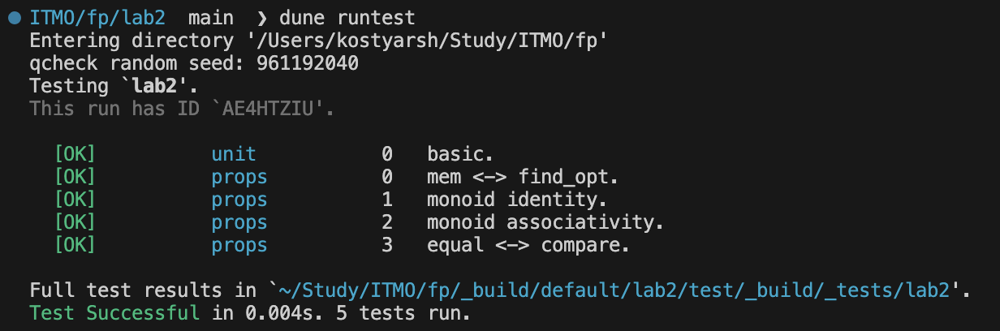
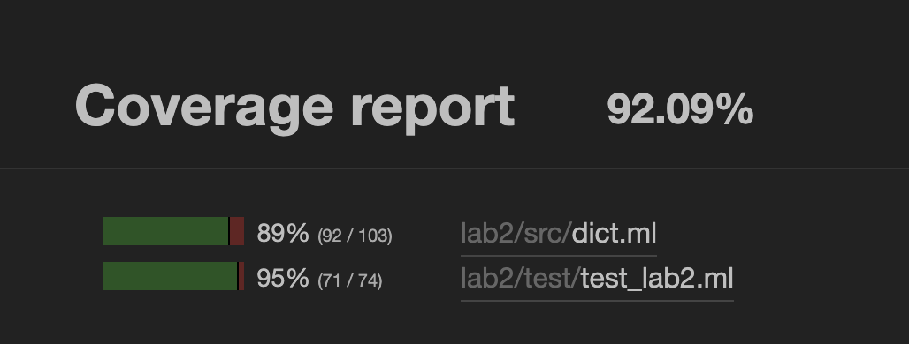

# Лабораторная №2 построение структуры данных rb-dict-lazy

## Рощин Константин Эдуардович

## Требования к разработанному ПО

1. **Функциональность**
   - Добавление и удаление элементов.
   - Фильтрация.
   - Отображение (map).
   - Свертки (левая и правая).
   - Структура должна быть **моноидом**.

2. **Структуры данных**
   - Должны быть **неизменяемыми**.
   - Должны быть **полиморфными**.

3. **Тестирование**
   - Unit-тесты.
   - Property-based тестирование (не менее 3 свойств, включая свойства моноида).

4. **Стиль программирования**
   - Идиоматичное использование функционального программирования.
   - Реализация API вручную (не за счет стандартной библиотеки).

5. **API**
   - Реализовано строго по интерфейсу (dict, set, bag).
   - Эффективная реализация сравнения (не через сортировку списка).
   - Тесты должны проверять именно API, а не внутреннюю реализацию.

---

## Ключевые элементы реализации

- **Модульность**
  - `Ordered.ORDERED` — минимальный интерфейс ключа: `type t; val compare : t -> t -> int`.
  - `Dict.Make(Ord)` → `S with type key = Ord.t` — функтор, фиксирующий порядок ключей.

- **Структура данных**
  - Персистентное КЧ-дерево:
    ```ocaml
    type color = R | B
    type 'a t = E | T of color * 'a t * key * 'a * 'a t
    ```
  - Без `mutable/ref` → неизменяемость.

- **Вставка с балансировкой**
  - Вставка «как в BST» + локальная ребалансировка четырёх шаблонов:
    ```ocaml
    let balance = function
      | B, T(R, T(R,a,xk,xv,b), yk, yv, c), zk, zv, d
      | B, T(R, a, xk,xv, T(R,b,yk,yv,c)), zk, zv, d
      | B, a, xk,xv, T(R, T(R,b,yk,yv,c), zk,zv, d)
      | B, a, xk,xv, T(R, b,yk,yv, T(R,c,zk,zv,d)) ->
          T(R, T(B,a,xk,xv,b), yk,yv, T(B,c,zk,zv,d))
      | col,l,k,v,r -> T(col,l,k,v,r)
    ```
  - Корень всегда чёрный.

- **Удаление (простая версия)**
  - Пересборка через `fold_left` без мутаций (достаточно для ЛР).

- **Ленивый обход (курсор)**
  - In-order итерация без промежуточных списков:
    ```ocaml
    type 'a cursor = ('a t) list
    val cursor_next : 'a cursor -> ((key * 'a) * 'a cursor) option
    ```
  - Используется в `fold_left`, `compare`, `equal`.

- **Свёртки / итерации**
  - `fold_left f acc t` — на курсоре (in-order).
  - `fold_right f t acc` — рекурсивно (R→K→L).
  - `iter_inorder` — обход без аллокаций списков.

- **Функциональный API**
  - `add`, `remove`, `find_opt`, `mem`, `map`, `filter`.
  - Полиморфность по значению: `'a t`; по ключу — через функтор.

- **Моноид**
  - Нейтральный элемент: `empty_monoid = empty`.
  - Операция: `append : ('a -> 'a -> 'a) -> 'a t -> 'a t -> 'a t`
    (при коллизии ключа используется `combine`).

- **Эффективное сравнение**
  - `compare : ('a -> 'a -> int) -> 'a t -> 'a t -> int`
  - Одновременное продвижение двух курсоров → O(n), без `to_list`/`sort`.

- **Тесты**
  - Unit (Alcotest): базовые операции (`add/remove/map/filter/fold`).
  - Property (QCheck):  
    1) `mem` <-> `find_opt`;  
    2) моноид — нейтральный элемент;  
    3) моноид — ассоциативность;  
    4) (доп.) `equal` ↔ `compare`.

- **Сложности**
  - `add/find/mem` — O(log n) амортизировано.
  - `append` — O(n) по второму аргументу.
  - `compare/equal` — O(n) по min(|a|,|b|).

## Tecты
 - **Юнит-тесты**
```ocaml
let test_basic_ops () =
  let d = of_list [1,"a"; 2,"b"; 3,"c"] in
  Alcotest.(check bool) "mem 2" true (D.mem 2 d);
  Alcotest.(check (option string)) "find 1" (Some "a") (D.find_opt 1 d);

  let d' = D.remove 2 d in
  Alcotest.(check bool) "mem 2 after remove" false (D.mem 2 d');

  let d2 = D.map String.uppercase_ascii d in
  Alcotest.(check (option string)) "map keeps value"
    (Some "B") (D.find_opt 2 d2);

  let d3 = D.filter (fun k _ -> k mod 2 = 1) d in
  Alcotest.(check bool) "filter drops even keys" false (D.mem 2 d3);

  let keys_l = D.fold_left (fun acc k _ -> k :: acc) [] d |> List.rev in
  let keys_r = D.fold_right (fun k _ acc -> k :: acc) d [] in
  Alcotest.(check (list int)) "fold orders equal" keys_l keys_r
```

- **Property-based tests**
```ocaml
module QC = QCheck

let gen_dict =
  let open QC in
  let gen_pair = Gen.(map2 (fun k v -> (k,v)) small_int small_int) in
  let gen_list = Gen.list_size (Gen.int_range 0 60) gen_pair in
  make ~print:(Print.list (Print.pair Print.int Print.int)) gen_list
  |> set_shrink Shrink.list
  |> map of_list

(* 1) mem <-> find_opt *)
let prop_mem_find =
  QC.Test.make ~name:"mem <-> find_opt"
    QC.(pair small_int gen_dict)
    (fun (k, d) ->
       D.mem k d = Option.is_some (D.find_opt k d))

(* 2) моноид: нейтральный элемент и ассоциативность *)
let combine_left x _ = x

let prop_monoid_identity =
  QC.Test.make ~name:"monoid identity" gen_dict (fun d ->
    D.equal (=)
      (D.append combine_left d D.empty_monoid)
      d
    &&
    D.equal (=)
      (D.append combine_left D.empty_monoid d)
      d
  )

let prop_monoid_assoc =
  QC.Test.make ~name:"monoid associativity"
    QC.(triple gen_dict gen_dict gen_dict)
    (fun (a,b,c) ->
      let l = D.append combine_left (D.append combine_left a b) c in
      let r = D.append combine_left a (D.append combine_left b c) in
      D.equal (=) l r)

(* 3) equal <-> compare *)
let prop_equal_compare =
  QC.Test.make ~name:"equal <-> compare"
    QC.(pair gen_dict gen_dict)
    (fun (a,b) ->
      if D.equal (=) a b then D.compare Int.compare a b = 0
      else D.compare Int.compare a b <> 0)
```

- **Отчет инструмента тестирования**


- **Метрики**

Покрытие кода с помощью Bisect_ppx


## Вывод

В этой работе было сделано следующее:
- Реализован собственный **словарь на красно-чёрном дереве** в OCaml.  
- Структура данных получилась **неизменяемой** и **полиморфной** — может хранить любые значения.  
- Добавлены основные функции:
  - вставка и удаление элементов;
  - поиск по ключу;
  - фильтрация и преобразование значений (`map`);
  - свёртки (левая и правая);
  - операции моноида (пустой словарь и объединение).
- Написаны тесты:
  - unit-тесты для проверки функций;
  - property-based тесты для проверки свойств (например, ассоциативность объединения).
- Реализовано **эффективное сравнение словарей** без перевода в списки — через ленивый обход дерева.
- Проверено покрытие тестами с помощью `bisect_ppx`: достигнуто около **92% покрытия**.  

Итоговый результат — полноценная библиотека словаря в функциональном стиле с полным API, тестами и отчётами.

